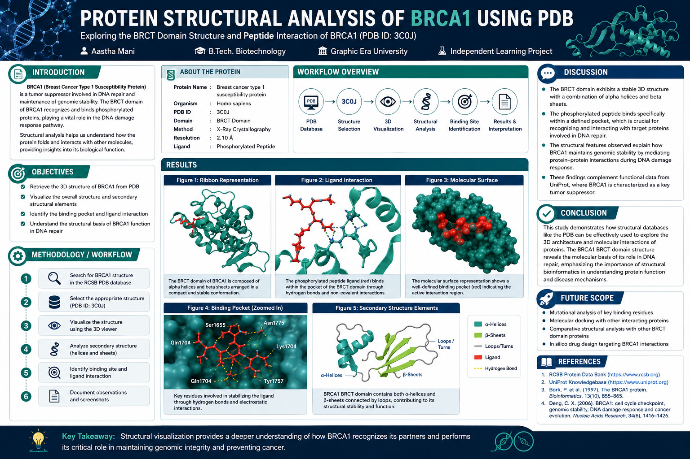

# 🧬 BRCA1 Protein Structural Analysis using PDB

## 🔍 Project Overview

This project focuses on analyzing the **three-dimensional structure** of the BRCA1 protein using the Protein Data Bank (PDB). The study explores structural features, ligand interactions, and functional insights of the BRCT domain.

---

## 👩‍🔬 Author

**Aastha Mani**
B.Tech Biotechnology
Graphic Era University

---

  

## 🧪 Tools & Databases Used

* Protein Data Bank (PDB)
* UniProt
* BLAST (NCBI)

---

## 🧬 Protein Details

* **Protein:** BRCA1 (Breast Cancer Type 1 Susceptibility Protein)
* **Organism:** Homo sapiens
* **PDB ID:** 3C0J
* **Domain:** BRCT domain

---

## ⚙️ Workflow

1. Search BRCA1 structure in PDB
2. Select structure (3C0J)
3. Visualize 3D structure
4. Analyze secondary structure
5. Identify binding site
6. Study ligand interactions

---

## 📊 Key Findings

* BRCA1 BRCT domain contains **alpha helices and beta sheets**
* Presence of a **specific binding pocket**
* Interaction with phosphorylated peptide via **hydrogen bonds**
* Important role in **DNA repair mechanisms**

## ⚠️ Limitations

* Only BRCT domain analyzed
* No experimental validation
* Limited to visualization-based study

---

## 🚀 Future Scope

* Molecular docking
* Mutation analysis
* Protein-protein interaction studies
* Structural comparison across species

---

## 📚 References

* Protein Data Bank (RCSB PDB)
* UniProt
* NCBI BLAST

⭐ If you found this project useful, feel free to star the repository!
